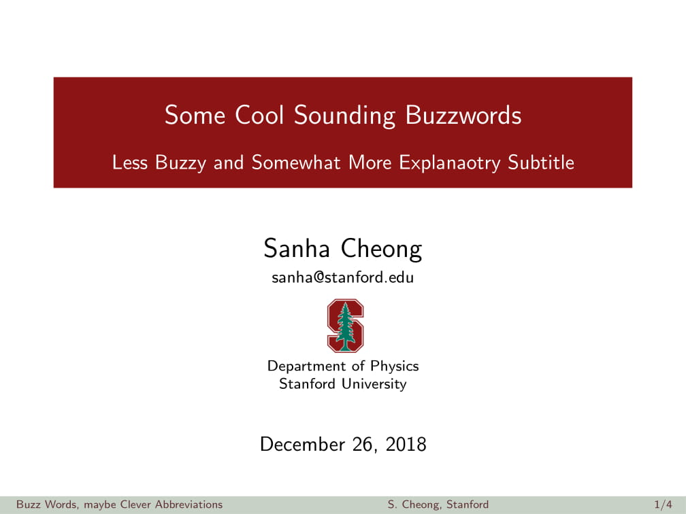
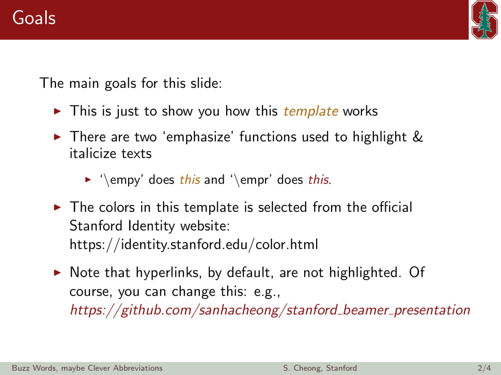
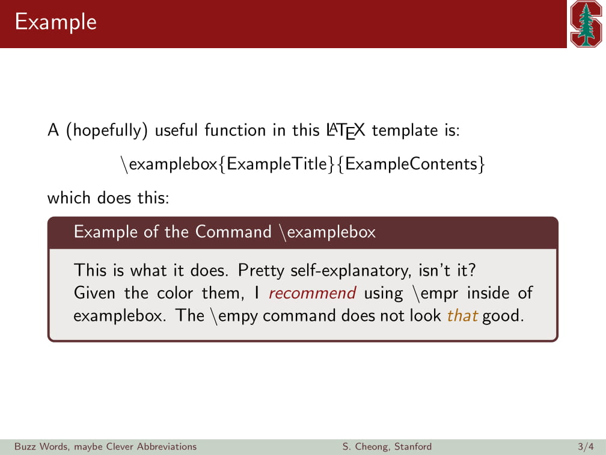
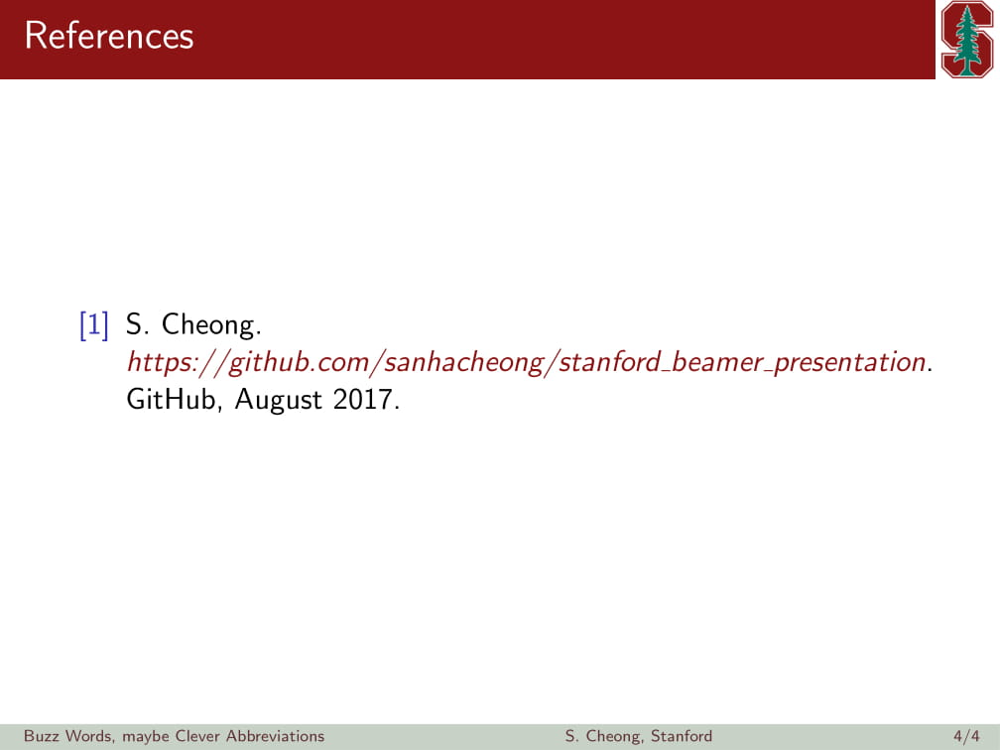

# Beamer and Quarto Presentation Templates
This is an unofficial LaTeX Beamer and Quarto presentation template.

Feel free to use this template for your project presentations and conference talks.

The repository includes [a simple example file](beamer_slides.pdf) (with the [`.tex`](beamer_slides.tex) source code) and [a full, example presentation slides](full_talk.pdf).

There is also a [Quarto](https://quarto.org/)  [example](quarto_slides.pdf) ([source code](quarto_slides.qmd)).

## Example Slides

